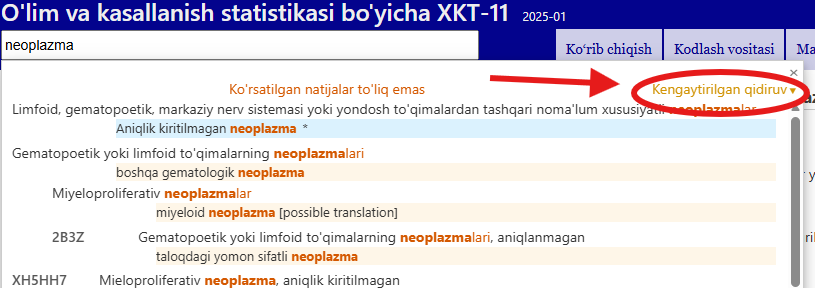
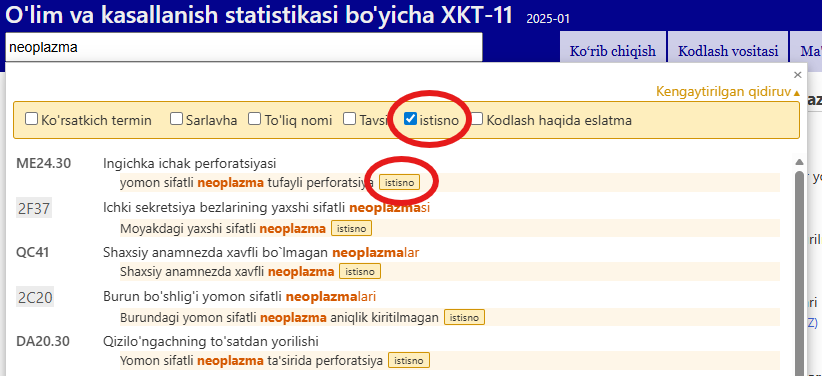

# Kengaytirilgan qidiruv bo'yicha yordam

Kengaytirilgan qidiruv sizga tasnifning tanlangan xususiyatlarini qidirish imkonini beradi. Siz barcha xususiyatlarni yoki tanlangan kichikk guruhni qidirishingiz mumkin. 

Iltimos, Qidiruv matni maydoniga kalit so‘zlarni kiriting va qidiruvga qo'shmoqchi bo'lgan xususiyatlaringizni belgilab qo'ying.

Tizim kalit so'zlarni belgilangan xususiyatlar ichida qidiradi. 

Natijalar kiritilgan matn XKTdagi iboraga qanchalik mos kelishiga qarab tartiblangan. Natijalar XKT iyerarxiyasidan foydalanib guruhlangan, shunda agar qidiruv matni yuqori darajadagi toifa va bir nechta bola toifasiga mos kelsa, ular bu munosabatni vizual aniqlash oson bo'lgan tarzda ko'rsatiladi. Ro'yxatda faqat sarlavhalar yoki agar salavha mos kelmasa, mos keladigan atamalar orasidagi eng yaxshi mos keladigani ko'rsatiladi. 

Agar siz bir nechta kalit so'zni kiritsangiz, tizim barcha kalit so'zlarga ega elementlarni qidiradi.
