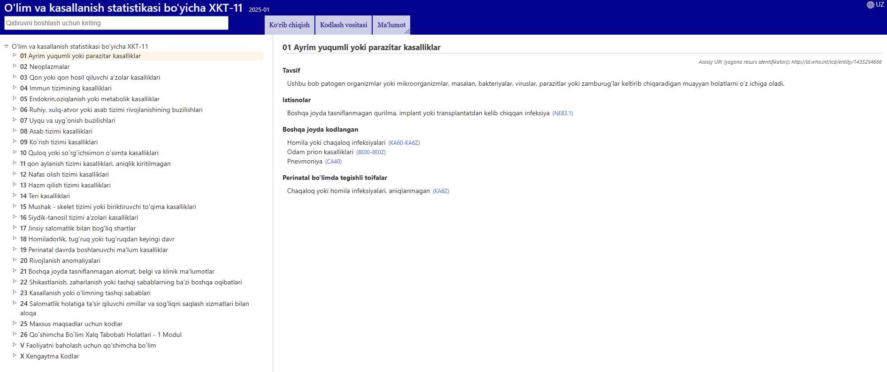
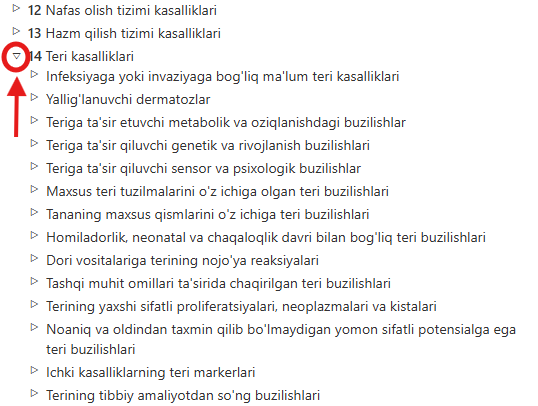
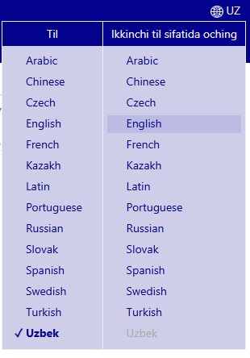
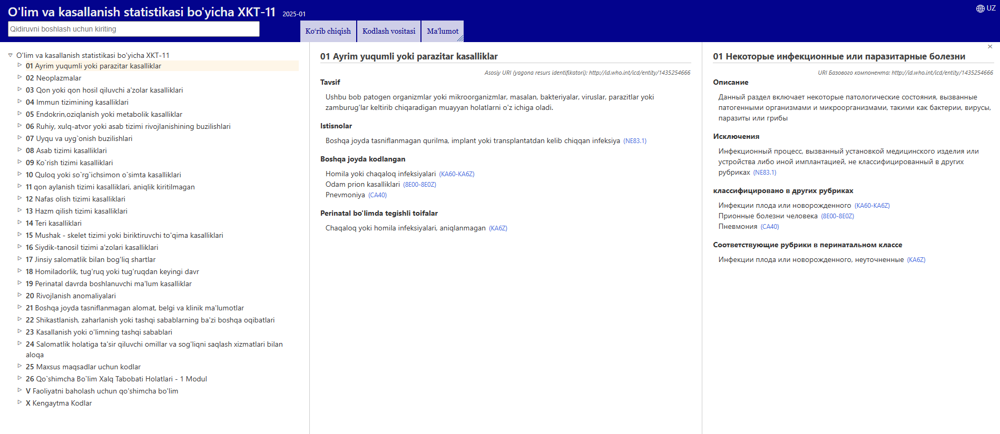
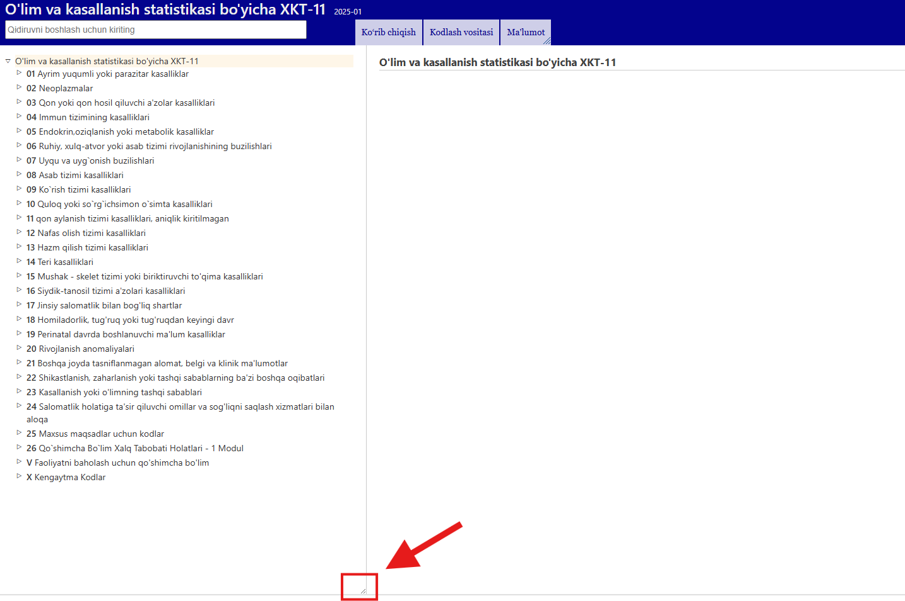

# XKT-11 Brauzer

XKT-11 Brauzer — bu foydalanuvchilarga XKTning 11-nashr kontentini ko‘rishga imkon beradigan veb-sahifa. 

Ushbu Foydalanuvchi qo‘llanmasida sahifadan foydalanish bo‘yicha batafsil ma’lumot beriladi. Siz qo‘llanmada chap tomondagi havolalar orqali o'tkazishingiz yoki menyular orqali XKT-11 Brauzer sahifasiga qaytishingiz mumkin. Quyida sahifadan samaraliroq foydalanishingizga yordam beradigan muhim ma’lumotlar keltirilgan.  

## Iyerarxiya orqali ko'rish

XKT-11 ni ko‘rayotganingizda, tasniflash ierarxiyasi ekraning chap tomonida aks etadi. Istalgan elementni bosganingizda, uning tafsilotlari ekraning o‘ng tomonida ko‘rinadi. 

Dastlab, tizim faqat yuqori darajadagi elementlarni ko‘rsatadi. Biroq, elementlarning chap tomonidagi kichik uchburchaklarni bosish orqali ularning quyi bo‘g‘inlarini ko‘rish mumkin.  

## Ko‘p tilli ko‘rish: ikki tilni bir vaqtda ishlatish 

Brauzer bir nechta tillarda mavjud. Sizga qulay tilni tanlash uchun, sahifaning yuqori burchagida joylashgan menyudan foydalaning, rasmda ko‘rsatilganidek. 

Til menyusining birinchi ustuni brauzer tilini belgilaydi. Til menyusining ikkinchi ustuni esa ko‘rish uchun ikkinchi tilni tanlash imkonini beradi, bu esa ikki tilni bir vaqtda ishlatishga sharoit yaratadi. Quyidagi rasmda ingliz va xitoy tillarini bir vaqtda ko‘rish misoli keltirilgan. 

## Qanday qilib iyerarxiyani gorizontal o'lchamini o'zgartirish

Sichqoncha bilan kursorni iyerarxiyaning pastki o'ng chetiga olib boring. O'lchamni o'zgartirish kursorini ko'rganingizdan so'ng, sichqonchaning chap tugmasini bosing va ushlab turing. Elementning kengligini sozlash uchun uning chetini chapga yoki o'ngga torting. 

Bir vaqtni o'zida ikkita til ishlatilganda ham ular o'rtasidagi o'lchamni o'zgartirish imkoni mavjud.
