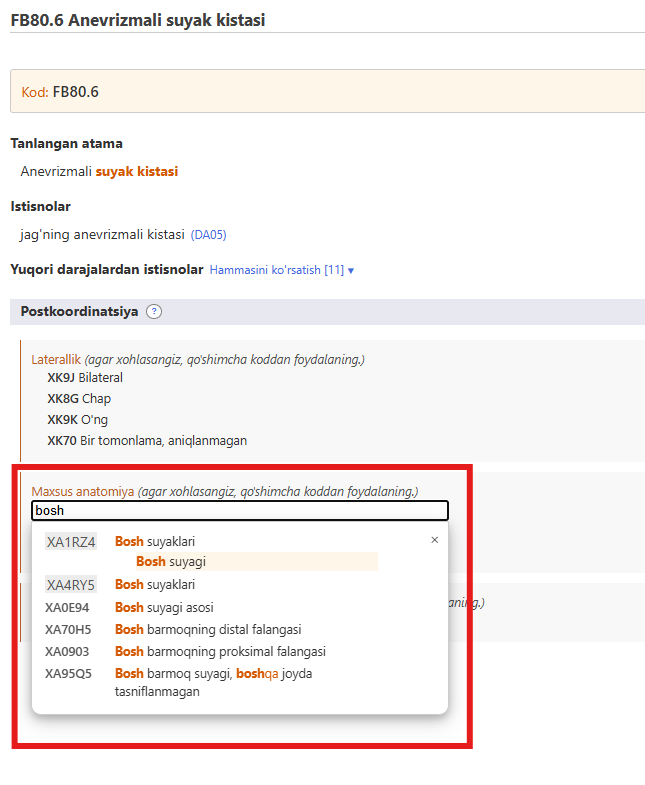
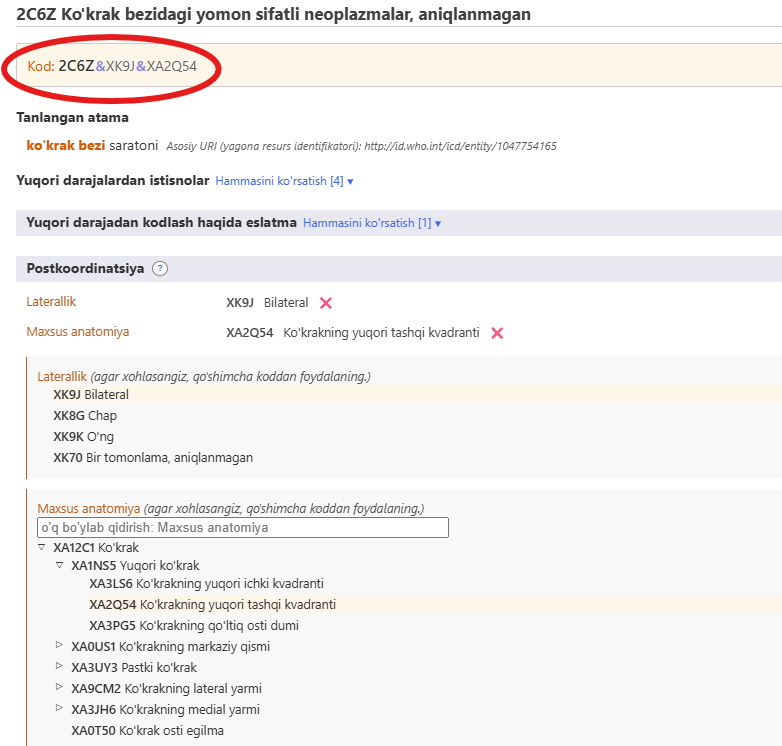
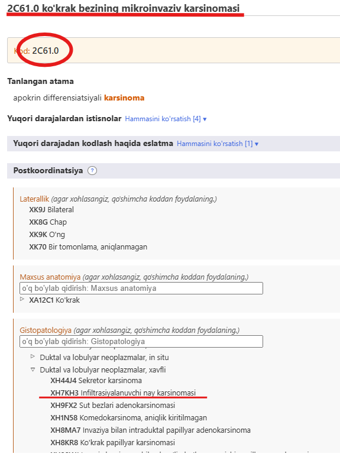

# Post-muvofiqlashtirish (Postkoordinatsiya)

Post-muvofiqlashtirish tizimi tanlangan obyektga qo'shimcha tafsilotlarni qo'shish imkonini beradi. Turli elementlarga turli xil ma'lumotlarni qo'shish mumkin. Misol uchun, ko'p o'sma toifalariga "gistopatologiya" ma'lumotlarini qo'shish mumkin, lekin tasnifning boshqa kategoriyalarga qo'shib bo'lmaydi.

XKT-11 brauzeridagi obyektda bo'lganingizda, post-muvofiqlashtirish maydoni faqat o'sha obyektga tegishli va qo'ysa bo'ladigan postkoordinatsiya o'qlarini ko'rsatadi. 

Ba'zi kategoriyalarda XKTning ko'p maqsadlari uchun to'liq bo'lmagan ma'lumotlar mavjud. Bunday hollarda, eslatma (kod ham) ushub o'q uchun ma'lumot qo'shilishi kerakligini ko'rsatadi. 

## Qiymat to'plamlarini ko'rsatish/qidirish

Ba'zi post-muvofiqlashtirish o'qlari Laterallik kabi kichikroq bo'lgan qiymatlar to'plamidan, ba'zi o'qlar esa Gistopatologiya kabi ancha katta qiymatlar to'plamidan qiymatlarni olishi mumkin. 

- Agar qiymatlar to'plami kichik bo'lsa, brauzer barcha mumkin bo'lgan qiymatlarni ularning kodlari bilan ko'rsatadi. 
- Agar qiymatlar to'plami katta bo'lsa, siz qidirish maydoniga yozib qiymatlar to'plamlarini qidirishingiz mumkin. Brauzer faqa shu o'q uchun qiymatlarni qidiradi. Qidiruvdan tashqari, siz ushbu kichik iyerarxiyani ▷ belgisi yordamida ko'rib chiqishingiz mumkin.  

Ba'zan, o'q uchun o'rnatilgan qiymatlar to'plami katta bo'lsa ham, to'plamdagi barcha qiymatlar ham kasallik uchun tegishli emas. Bunday hollarda, brauzer faqat tegishli qismini ko'rsatadi/qidiradi. Agar qo'llanilishi mumkin bo'lgan qiymatlar soni 12dan kam bo'lsa, brauzer ularning barchasini ko'rsatadi. Agar natija kattaroq  bo'lsa, brauzer o'qlarni qidirishni va ko'rishni imkonini beradi.      

Masalan, Anevrizmali suyak kistasini maxsus anatomik tafsilotlar bilan post-muvofiqlashtirish mumkin, ammo barcha qiymatlar ham tegishli emas. Bunday hollarda, brauzer faqat tegishlilarini ko'rsatadi/qidiradi. Quyidagi misolda, foydalanuvchi "Bosh"ni qidirganda, tizim faqat "maxsus anatomiya" o'qining "suyaklar" bo'limida joylashgan natijalarni ko'rsatadi.  

## Building a Code String

To build a code you need to click on the values that are displayed in the search results, in the hierarchy or in the shorter lists. The example below shows malignant neoplasm of breast detailed with laterality and specific anatomy. The code generated is shown at the top left area of postcoordination section.

## Postcoordination using multiple values from the same axis

The system allows one value per axis for most of the postcoordination axes. For example, when post-coordinating with "severity" you can't pick the value "mild" and "moderate" at the same time. However, for certain axes, the system allows providing multiple values. The axes that allow multiple values are listed below:

- Associated with
- Causing condition
- Has manifestation
- Specific anatomy
- Infectious agents
- Chemical agents
- Medication

For these axes, you may provide more than one value. For example, when postcoordination with specific anatomy is allowed, you may select more than one site

And for some of the external causes axes, we allow multiple values only when they come from different blocks

For example, when post-coordinating Unintentional land transport traffic event injuring a pedal cyclist using the Transport event descriptor axis, we can use one value from the block "VEHICLE USER ROLE OF PERSON INJURED IN TRANSPORT RELATED EVENT" and another from the block "COUNTERPART IN LAND TRANSPORT CRASH" but we can't use two values from the same block.

When multiple values for an axis is not allowed and the user clicks on the second one, the system will replace the existing value. For example, when you are post-coordinating with severity and have already chosen mild as a value, clicking on moderate will replace the mild value with the moderate value.

## Postcoordination / pre-coordination equivalence

In certain cases the combination built by the user may be equivalent to an existing entity in the classification. In these cases, the system will automatically use the pre-coordinated concept when it's building a code. In the example below, the user has chosen Invasive carcinoma of breast and post-coordinated it with Infiltrating duct carcinoma, NOS. However, instead of giving two codes, the system gives just one code because in the classification there is a category for this combination i.e. 2C61.0 Invasive ductal carcinoma of breast and therefore it is given as the code.

## Nested postcoordination

In certain cases the system may allow further specifiying the postcoordination values. (i.e postcoordinating the postcoordination values) 
