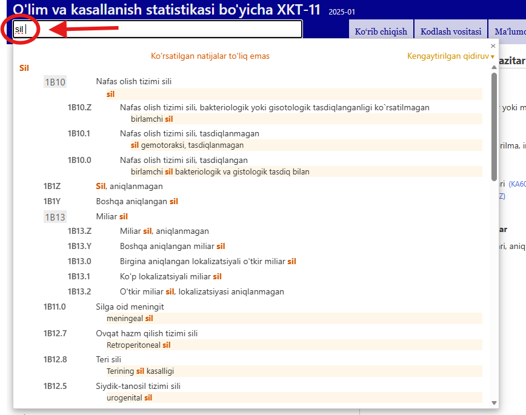

# Tezkor qidirish bo'yicha yordam

Tezkor qidirish sizga ma'lum bir toifaga tezda o'tishga yordam beradi. U sarlavhalar, qo'shimchalar, sinonimlar va tor ma'noli atamalarni qidiradi ba siz terayotganizda qidiruvni boshlash va dinamik ochiladigan ro'yxatda sizga variantlarni taqdim etish orqali ishlaydi. 

Ro'yxatda ko'rsatilgan obyektlardan birini bosish shu obyektni yuklaydi.

Natijalar kiritilgan matn XKTdagi iboraga qanchalik mos kelishiga qarab tartiblangan. Natijalar XKT iyerarxiyasidan foydalanib guruhlangan, shunda agar qidiruv matni yuqori darajadagi toifa va bir nechta bola toifasiga mos kelsa, ular bu munosabatni vizual aniqlash oson bo'lgan tarzda ko'rsatiladi. Ro'yxatda faqat sarlavhalar yoki agar sarlavha mos kelmasa, mos keladigan atamalar orasidagi eng yaxshi mos keladigani ko'rsatiladi. 
